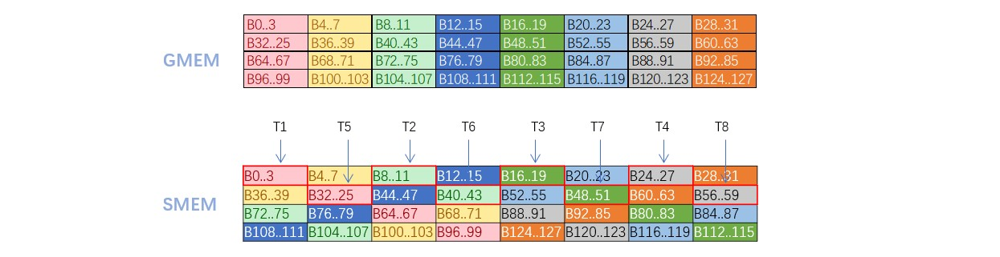

# 概述
- 优化kernel 6，将LD A/B SMEM的过程也使用大位宽数据的方式，性能有所提升。代码存放为kernel 13。
- 修改kernel 7中，为解决Bs的bank conflicts，对Bs每个元素按照一个warp中的每个thread进行interleave排布的方式，更改为大位宽（128b）数据的XOR Swizzling方式, 代码存放为kernel 14。

| 核函数   | GFLOPS | 核函数 | GFLOPS  
| -------- | ---------- | --------  | ----------
| kernel_6 | 5492.5     | kernel_13 | 5622.5
| kernel_7 | 5769.0     | kernel_14 | 5762.4

```
NVIDIA GeForce GTX 1080，矩阵尺寸4096
编译采用 MSVC 14.24/ NVCC under Windows 10
NVIDIA CUDA version: CUDA 12.6
```

# 说明
## 使用LDS.128读取SMEM数据
使用`reinterpret_cast<float4*>`的类型转换可以编译得到128位大位宽的访存指令。kernel6原代码使用顺序LOAD SMEM的代码可以优化成大位宽的形式。
```cpp
      for (uint i = 0; i < TM; ++i) {
        regM[i] = As[dotIdx * BM + threadRow * TM + i];
      }
      for (uint i = 0; i < TN; ++i) {
        regN[i] = Bs[dotIdx * BN + threadCol * TN + i];
      }
```

## 分阶段进行大位宽访问SMEM
SMEM的最大访问带宽是128字节，对于4字节（float）的访问，刚好能满足一个warp里的所有线程同时进行。
而对于16字节（float4）或8字节（float2）的大带宽访存，则需要分阶段进行访存。对于16字节：每个阶段处理1个wrap中的每8个线程。
因此在bank conflicts的问题上，只有考虑每8个线程间是否冲突，而不需要考虑所有32个个线程。

kernel7原代码中尽管使用的float4数据类型从全局内存B中读取，但在LD/ST共享内存Bs时都是考虑单个float数据，考虑的是32个线程的bank conflicts。
没有按照float4的方式在SMEM上进行LD/ST。

我试着实现了在LD/ST Bs中仍然使用float4的类型，即将4个连续元素看作一组，进行XOR Swizzling，只考虑连续的8个线程没有bank conflicts。
结果显示，性能与原代码等同。


可以看出，经过swizzling后，T1...T8分布在不同的bank上，没有造成bank conflicts。
kernel14仅优化了对Bs的float4访存，对As的布局优化可以参考cutlass的文档。